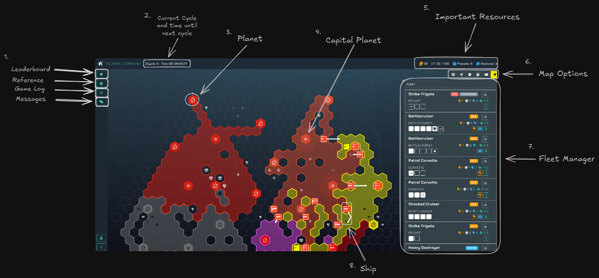

[Home](README.md)

## The UI

1. Here you can find helpful shortcuts to the Leaderboard, Reference Guide, Game Log and Messages.

2. This represents the games current cycle as well as what tick the game is currently on. The time ticks down towards the next cycle.

3. This represents **Planets**. Capture these with your ships.

4. This star icon represents your **Capital** planet. Protect this at all cost. Lose this, and you will find your entire logistics in shambles.

5. This represents important resources in your empire. From Left to Right: 
    * Your **Prestige** acts as money. 
    * **VP or Victory Points** is your score. To win the game, you need to be the first to obtain 100. 
    * This represents your total **Planets** you own. 
    * This represents your total **Stations** you own.

6. Map Options. From Left to Right:
    * Toggle Hex Coordinates
    * Toggle Supply Network
    * Toggle Zone of Control
    * Toggle Hex MP Cost
    * Toggle Hex Graphics
    * Toggle Units

7. Here you can quickly view all the units you own within your empire.

8. This represents your ship and the arrow extending from it is the ship's current movement path.

**Up Next**: [Ship UI Overview](ship-ui-overview.md)

### Terrain 

| Type | Icon |
|---|---|
| Asteroid Field | ◌ |
| Debris Field | ⦼ |
| Gas Cloud | ⩯ |
| Gravity Well | ⧨ |
| Industrial Zone | ⛋ |
| Nebula | ≈ |
| Radiation Storm | ☢ |